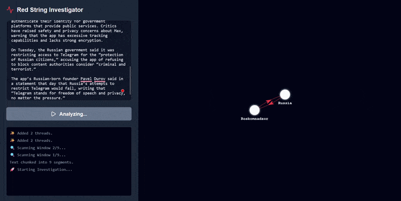

# Red String



Red String is an application that generates interactive knowledge graphs in real-time from provided text. It utilizes a fine-tuned, quantized LLaMA 3.1 8B model to perform entity relationship extraction, processing text through sliding semantic windows to build a comprehensive node-link visualization.

**Model Weights:** The fine-tuned and quantized GGUF model is publicly hosted on Hugging Face: [tspec2/redstring-8gb](https://huggingface.co/tspec2/redstring-8gb/).

## Features

* **Real-Time Graph Generation:** Extracts entities and relationships from input text and visually constructs the graph dynamically.
* **Interactive Visualization:** Users can hover over nodes and edges to view specific connection details, and click and drag nodes or isolated graph components to reorganize the layout.
* **Deep Context Parsing:** To overcome the model's limitation of extracting a small number of relationships per prompt, the application chunks input text into 2-sentence sliding windows. While this increases processing time, it ensures fine-grained, deep contextual relationship extraction across documents of any length.

## Architecture & Fine-Tuning

* **Base Model:** Meta LLaMA 3.1 8B.
* **PEFT / LoRA Configuration:** The model was fine-tuned using Unsloth with a LoRA rank of 32 and an alpha of 16. Crucially, the adapters were applied to *all* linear projection modules (`q_proj`, `k_proj`, `v_proj`, `o_proj`, `gate_proj`, `up_proj`, `down_proj`). This comprehensive targeting was necessary because the model was trained on a dual-objective: executing accurate semantic relationship extraction while strictly adhering to a JSON output structure.
* **Optimization:** Training utilized the `adamw_8bit` optimizer, which provided stable convergence without the need for extensive hyperparameter sweeps. 
* **Quantization Strategy:** The final model is serialized in the GGUF format using 8-bit (Q8_0) quantization. During development, 4-bit quantization (Q4_K_M) was evaluated and yielded ~50% faster inference times. However, the 4-bit degradation severely impacted the model's ability to output valid JSON (requiring manual prompt pre-filling) and resulted in highly inaccurate relation extractions. Q8_0 was selected as the optimal deployment format, as the speed trade-off is negligible on GPU hardware while fully preserving output fidelity.

## Data Pipeline

The model was trained on the REBEL dataset, which specializes in relation extraction. The data engineering pipeline involved several preprocessing steps:
1.  **Parquet Integration:** The dataset was loaded from an auto-converted Parquet branch to bypass outdated and broken Hugging Face dataset loading scripts.
2.  **Tag Parsing & Formatting:** The dataset's native string format (utilizing `<triplet>`, `<subj>`, and `<obj>` XML-style tags) was systematically parsed and converted into a structured JSON dictionary format.
3.  **Heuristic Filtering:** To maintain high-quality target distributions and prevent sequence length issues, entries were filtered out if they contained malformed text or possessed more than 5 distinct relationships. This yielded a refined dataset of approximately 16,000 examples.
4.  **Instruction Tuning:** The processed JSON triplets and context windows were mapped to a standard Alpaca instruction-tuning prompt format to condition the model for zero-shot extraction.

## Challenges & Solutions

* **Hosting the API:** Initial deployment attempts using ngrok resulted in frequent pipeline errors. The server architecture was migrated to Cloudflare Tunnels, which provided a more stable and consistent hosting environment, albeit with a slight reduction in speed.
* **Contextual Limits:** The fine-tuned model exhibited a ceiling of extracting ~5 relations per prompt, mirroring the distribution of the training data. This was resolved on the frontend by implementing a sliding window text parser, trading overall processing speed for extraction depth.

## Repository Structure

```text
red-string/
├── app/                # React/Vite frontend application
├── notebooks/
│   ├── server.ipynb    # Inference server initialization and hosting
│   └── train.ipynb     # Model fine-tuning notebook
├── train_utils/        # Utilities for model training
│   ├── config.py
│   ├── data_utils.py
│   └── model_utils.py
└── requirements.txt    # Python dependencies

```

## Dependencies

The Python environment requires the following packages, detailed in `requirements.txt`:

* `unsloth[colab-new] @ git+https://github.com/unslothai/unsloth.git`
* `torch`
* `transformers`
* `datasets`
* `llama-cpp-python`
* `openai`
* `trl`
* `tqdm`

## Evaluation & Performance Metrics

The pipeline's extraction speed was benchmarked across various document lengths using the quantized Q8_0 model hosted via Cloudflare Tunnels. The sliding window approach ensures deep contextual extraction with the following performance observed on a standard GPU instance:

* **467 words:** 22 seconds (~21.2 words/sec)
* **599 words:** 45 seconds (~13.3 words/sec)
* **716 words:** 61 seconds (~11.7 words/sec)
* **1216 words:** 81 seconds (~15.0 words/sec)

**Average Processing Speed:** ~14.3 words per second.

## Getting Started

Training is not required to run the application. The project consists of a Python-based Colab server for model inference and a React frontend for visualization.

### Prerequisites

* Google Colab account (A standard T4 GPU instance is sufficient; higher RAM/GPU instances will yield faster inference).
* Node.js and npm installed locally.

### Running the Server

1. Open `notebooks/server.ipynb` in Google Colab.
2. Connect to a runtime equipped with a GPU.
3. Run all cells in the notebook.
4. The final cell execution will generate a secure Cloudflare URL (e.g., `https://<random-string>.trycloudflare.com`). Copy this URL.

### Running the Client

1. Navigate to the frontend directory:
```bash
cd app
```
2. Open `App.jsx` and locate the configuration section at the top of the file.
3. Paste the copied Cloudflare URL into the `API_URL` variable.
4. Start the development server:
```bash
npm run dev
```
5. Open your browser to the provided localhost address. Paste your text into the input area and click "Start Investigation" to begin generating the graph.